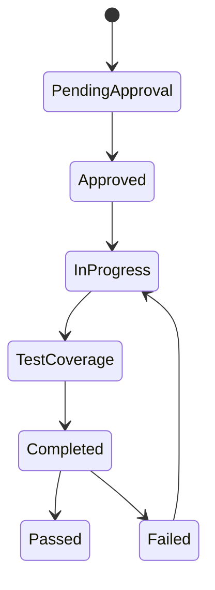
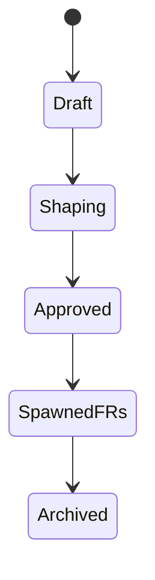
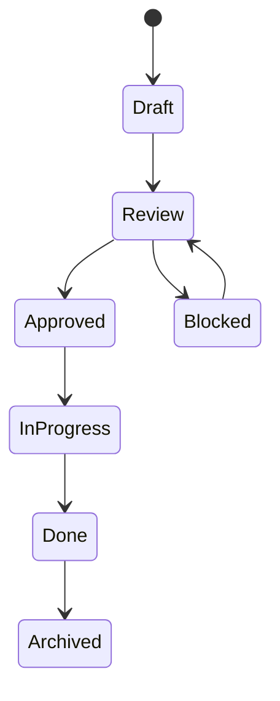
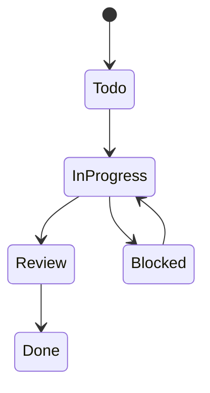

# VIRRIC State Machine (Working Draft)

This is a **living sketch** of the machine-optimized VIRRIC workflow.

## First principles

- **Repo is canonical knowledge**: SDLC documents live in the repo as parseable Markdown.
- **GitHub Issues are canonical operational state + human intent**: humans move cards, edit statuses, and talk to agents in comments.
- **Stance B**: repo documents **mirror** key operational state in a lightweight way (headers + history) so agents can operate locally without polling GitHub.
- **PR is the hard synchronization point** between work-in-flight and truth being merged.

## Nine-domain execution model (scaffold)

VIRRIC assumes work is organized into **nine domains of product execution**. Incoming agents should be assigned exactly one **primary domain** on entry (see `virric/AGENTS.md`).

Domains:

- **ideation** (idea)
- **research** (research-assessment)
- **product-marketing** (persona, proposition)
- **product-strategy** (product-roadmap)
- **product-management** (product-spec)
- **feature-management** (feature-request)
- **scrum-management** (issue)
- **test-management** (test-plan)
- **retrospective** (postmortem, playbook)

Default handoff spine (subject to refinement):

`ideation → research → product-strategy → product-management → feature-management → scrum-management → test-management → retrospective`

`product-marketing` runs alongside strategy/spec and constrains messaging and personas for downstream artifacts.

## Platform capability reality-check (GitHub Issues / GitHub Projects / GitHub Actions / Linear)

This section is here to **constrain the design to what the platforms can actually do**, so VIRRIC doesn’t assume features that aren’t universally available.

### GitHub Issues (baseline)

GitHub Issues are excellent for:

- **Conversation + human intent** (comments, assignments, labels)
- **Light metadata** (labels, assignees, milestones)
- **PR linkage** (closing keywords, cross-linking, auto-close on merge)

GitHub Issues alone are *not* a full Kanban engine in the “board columns” sense, but they are the most universal substrate for VIRRIC because:

- **Labels** are ubiquitous and easy to automate against.
- Issue events like **labeled/unlabeled** are widely supported for triggering automation.

For VIRRIC’s portability goals, **labels are the baseline contract** for Issue type + status. Projects/Linear are optional views.

### GitHub Projects (Projects v2) *(optional view layer)*

Projects v2 is where GitHub becomes a Kanban system:

- **Boards** with a **Status** field (usually single-select)
- **Custom fields** (single select, text, number, date, iteration)
- **Views** (filter/sort/group)
- **Built-in workflows/automations** (limited but useful)

Implication for VIRRIC:

- Projects can provide nicer boards and custom fields, but VIRRIC must not require it.
- If Projects is used, a Project “Status” change SHOULD be mirrored into a label change (so automation stays label-driven).

### GitHub Actions

Actions can trigger on:

- **repo events** (push, PR opened/merged, file changes)
- **issue events** (opened/edited/labeled; but “Project field changed” support varies and may require using APIs)
- **manual dispatch** events

Implication for VIRRIC:

- The most reliable, repo-sovereign trigger remains: **repo file changes** (e.g., signals folder, doc header changes, PR merges).

### Linear *(optional view + delegation layer)*

Linear is excellent at:

- **Human-friendly issue workflows** (statuses/columns)
- **Delegation/assignment** and “pretty” progress views
- **Hierarchy** (projects/initiatives, and issue relationships)
- **Integrations** that route work to agents

Key constraint:

- Linear workflow configuration is typically **per-team workflow** (statuses), not “arbitrary per-issue-type workflows” unless you model types via teams/projects/labels.

Implication for VIRRIC:

- Linear can be used for human UX and delegation, but VIRRIC must not require it.
- Linear state changes SHOULD be mirrored into GitHub label changes (directly or via integrations), keeping the automation contract stable.

## Entities (documents + system objects)

- **IDEATION**: `virric/domains/ideation/ideas/IDEA-*.md` *(scaffold)*
- **RESEARCH**: `virric/domains/research/research-assessments/RA-*.md` *(scaffold)*
- **PRODUCT MARKETING**:
  - Personas: `virric/domains/product-marketing/personas/PER-*.md` *(scaffold)*
  - Propositions: `virric/domains/product-marketing/propositions/PROP-*.md` *(scaffold)*
- **PRODUCT STRATEGY**: `virric/domains/product-strategy/product-roadmaps/ROADMAP-*.md` *(scaffold)*
- **PRODUCT MANAGEMENT**: `virric/domains/product-management/product-specs/SPEC-*.md` *(scaffold)*
- **FEATURE MANAGEMENT (FR dossier)**: `virric/domains/feature-management/frs/FR-*.md` *(current; tooled)*
- **SCRUM MANAGEMENT (Issue mirror, optional)**: `virric/domains/scrum-management/issues/ISSUE-*.md` *(scaffold)*
- **TEST MANAGEMENT (test plan)**: `virric/domains/test-management/test-plans/TP-*.md` *(scaffold)*
- **RETROSPECTIVE**:
  - Postmortems: `virric/domains/retrospective/postmortems/PM-*.md` *(scaffold)*
  - Playbooks: `virric/domains/retrospective/playbooks/PB-*.md` *(scaffold)*
- **GitHub Issue**: operational state + routing + conversation
- **Pull Request**: integration artifact linking code to Issues/FRs

## Common header schema (bash-parseable)

Every repo doc type SHOULD start with a strict header block of `Key: Value` lines, terminated by the first blank line.

Minimum viable fields (per doc):

- `ID: <stable-id>` (e.g. `FR-004`, `ID-0001`)
- `Title: ...`
- `Status: ...`
- `Updated: YYYY-MM-DD`
- `Dependencies: <comma separated stable IDs>` (optional but recommended)

Linkage fields (recommended):

- `Issue: #123` *(or full URL)*
- `PR: #456` *(or full URL; may be empty until created)*
- `Linear: ...` *(optional)*

## Status model (two layers)

### A) Issue types + per-type status (operational truth)

Issues are **typed** SDLC objects. Each type has:

- its own objective
- its own status workflow
- parent/child nesting (fan-out)

Humans move Issues on boards and talk to agents in comments; those changes trigger automation.

#### Issue types (examples; expandable)

- **IDEATION**: ideas / opportunities / problem framing
- **RESEARCH**: research assessments (feasibility, competitive, spikes)
- **PRODUCT-MARKETING**: personas, propositions, positioning constraints
- **PRODUCT-STRATEGY**: roadmaps, bets, outcomes, sequencing
- **PRODUCT-MANAGEMENT**: specs, requirements, acceptance criteria
- **FEATURE-MANAGEMENT (FR)**: feature request lifecycle (spec + acceptance)
- **SCRUM-MANAGEMENT (ISSUE)**: operational work items (often GitHub Issues)
- **TEST-MANAGEMENT (TEST-PLAN)**: test plans + execution strategy
- **RETROSPECTIVE**: postmortems, playbooks, lessons capture

#### Nesting rules (the key “fan-out” property)

- One **IDEA** can spawn many **FR** issues/docs.
- One **FR** can spawn many **TASK** issues/docs.
- One **TASK** can spawn many **TEST/PLAN** and/or **REVIEW** artifacts.

#### Per-type status workflows (illustrative)

We define each type’s status workflow independently. Example:

- **IDEA**: `Draft` → `Shaping` → `Approved` → `Spawned FRs` → `Archived`
- **FR**: `Draft` → `Review` → `Approved` → `In Progress` → `Done` → `Archived`
- **TASK**: `Todo` → `In Progress` → `Review` → `Done` (→ `Blocked` as side state)

> Important: “Idea / Research / FR Draft …” are **types + statuses**, not one global status ladder.

#### How to represent Issue Type + Issue Status (portable approach)

To avoid depending on Projects/Linear or platform-specific “issue types” features, VIRRIC treats **labels** as the canonical operational interface.

##### Label taxonomy (recommended)

Use **two required labels** on every VIRRIC-managed Issue:

- **Type label**: exactly one
  - `virric:type/IDEA`
  - `virric:type/RESEARCH`
  - `virric:type/FR`
  - `virric:type/TASK`
  - `virric:type/TESTPLAN`
  - `virric:type/REVIEW`
  - `virric:type/RETRO`

- **Status label**: exactly one (status set is *per type*)
  - `virric:status/<STATUS>` (e.g. `virric:status/Draft`, `virric:status/Approved`, `virric:status/InProgress`, `virric:status/Blocked`, `virric:status/Done`)

Optional labels:

- Priority: `virric:prio/High|Medium|Low`
- Agent routing: `virric:agent/Codex|Claude|Cursor|Human`
- Blocked reason: `virric:blocker/<ID>` (optional; can be too chatty)

##### Why labels

- Works with plain GitHub Issues (no Projects required).
- Easy to trigger Actions on `labeled` events.
- Easy for Linear/GitHub Projects to mirror into (labels become the shared lingua franca).

VIRRIC should treat the operational layer as providing two values:

- `IssueType` (IDEA/FR/TASK/…)
- `IssueStatus` (type-specific workflow status, represented as a label)

### B) Repo header status (mirrored truth)

Repo statuses exist to support local agent work + deterministic indexing.

For FR dossiers (current):

- `Pending Approval`
- `Approved`
- `In Progress`
- `Test Coverage`
- `Completed`
- `Passed`
- `Failed`

For other doc types (future), we can define similarly, but this draft keeps them open.

## Mapping: Issue → Repo (mirroring)

**Goal**: when humans move an Issue, the repo eventually reflects that state in the relevant docs.

We do NOT require immediate consistency; we require a deterministic path to convergence.

### Preferred mechanism: “sync PR”

When Issue state changes:

- An automation workflow **opens a PR** that updates doc headers (and appends History lines).
- Merge makes it visible/auditable in the repo.

This preserves repo sovereignty and gives an audit trail.

### Alternative mechanism: “agent PR”

If the transition requires judgment (e.g., generating tasks, writing acceptance criteria), the workflow should **summon an agent** to create a PR that performs the richer update.

## Mapping: Repo → Issue (belts + braces)

Repo events that SHOULD reconcile issues:

- PR opened / draft → Issue moves to `Implementation` (or similar)
- PR ready-for-review → Issue moves to `Review`
- PR merged → Issue moves to `Done` (or “Released candidate”)
- PR closed without merge → Issue moves to `Blocked` / `Needs triage`

Additionally:

- On push to `main`, run a reconciliation workflow that detects drift and corrects Issue labels/fields.

## Signals (event bus)

Signals are parseable events used to route automation.

Two ways to implement signals:

1) **Repo signals**: committed files under `virric/signals/**` (auditable, repo-native)
2) **CI signals**: ephemeral signals derived from diffs / issue events (not committed)

This draft assumes we will primarily use **CI signals**, and only commit repo signals when we need explicit auditability.

Signal shape (example):

```
Entity: FR-004
Action: status.approved
Created: 2026-01-06
Source: github.issue
Issue: #123
```

## Minimal state machine (FR-centric)

### FR dossier states (repo)



### Issue type machines (operational)

These are illustrative “shape” diagrams showing that each Issue type has its own workflow.

#### IDEA Issue



#### FR Issue



#### TASK Issue



## Event table (first pass)

| Trigger (Issue/PR) | Meaning | Router emits | Repo mirror update (Stance B) | Fan-out |
|---|---|---|---|---|
| FR Issue → `Approved` | Human says feature is ready to build | `Action: fr.approved` | Set `Status: Approved` in FR header; append history | Spawn TASK Issues; request design/review |
| TASK Issue → `In Progress` | Work begins | `Action: task.start` | Optionally append task link into FR “Implementation Plan” section | Spawn coding agent job |
| PR opened and linked to Issue | Work has tangible code | `Action: pr.opened` | Optionally set `PR:` field in FR header via sync PR | Run checks; post status |
| PR merged | Code landed | `Action: pr.merged` | Set `Status: Completed` (or `Passed` if tests green) | Close Issue; trigger release workflows |

## Open questions (to resolve next)

1) What is the canonical mapping from **Issue type + status** to **repo doc type + header status** (configurable per repo)?
2) Do we store `Issue:` / `PR:` linkage in FR headers, or only in Issue body?
3) Do we want repo-committed signals, or only CI-derived signals?
4) What is the minimum set of specialist workflows (design, tests, security, UI/UX, retros) and their doc outputs?


