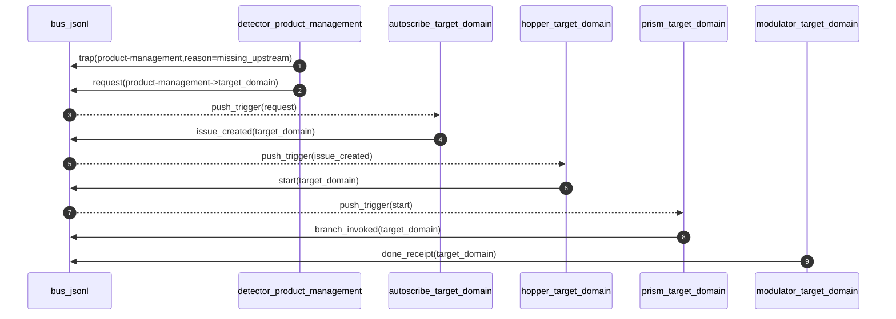

## Source

This plan is the in-repo copy of the Cursor plan file generated during the Option C planning session:

- `.cursor` plan origin: `option_c_compiler_pipeline_501f3d37.plan.md` (Cursor internal location)

---

# Option C: Full Compiler Pipeline + Bus-Native Bounce

## What “IR” means here (and why it matters)

**IR = Intermediate Representation** (compiler term): a structured, normalized artifact produced *between* high-level intent and low-level execution.

In PHOSPHENE:

- **High-level intent**: visions, hypotheses, audience framing.
- **IR stack**: pane-grade contracts that remove ambiguity (definitions/invariants, domain model/state, interface contracts, telemetry dictionary, security controls, eval harness, rollout plan).
- **Final assembly**: a PRD that is effectively a **linker output** over the IR stack.

Why it matters: once IR exists, **FR + Jira-style ticket generation becomes compilation**, not invention.

## Target flow (Option C, bus-native loopbacks)

### Domain intent by color

- **Viridian (DIVERGE)**
  - `<ideation>`: many narrative visions/seed ideas (breadth)
  - `<research>`: evidence, unknowns, candidate segments/personas, pitches
- **Beryl (CONVERGE)**
  - `<product-marketing>`: VPD bundles (PER/PROP constraints)
  - `<product-vision>` (new): 1 primary + up to 3 alternate visions, each with non-negotiables + trade-offs + falsifiers
  - `<product-strategy>`: roadmap **lattice** (2–4 trajectories + decision triggers/gates)
- **Cerulean (DEPTH / CONTRACTS)**
  - `<product-architecture>` (new): domain model/state + interface contracts + telemetry/security scaffolding
  - `<product-management>` (existing): compile IR stack → **assemble final PRD** (treat PRD as linker output, not the first artifact)
  - `<feature-management>` (existing scripts): compile PRD → FR dossiers
- **Cadmium (EVAL)**
  - `<product-evaluation>` (new): readiness rubric + eval harness hooks (gates for “ready to atomise/ship”)
  - `<test-management>` (existing stub): test plan bundles (TP) aligned to PRD/FRs
- **Amaranth (OPS)**
  - `<scrum-management>`: issue mirrors/sprint scoping
  - Importantly, AMARANTH IS WHERE ACTUAL AGENTIC CODING WILL OCCUR. The main point of Amaranth is actually dispatching agents to DO tasks in the codebase. But this is also why 'scrum-management' sits here.

### Bus-native “Cerulean invokes Viridian/Beryl” mechanism

Introduce a request signal family (append-only, hash-derived, idempotent):

- **Signal type**: `phosphene.request.<requesting_domain>.<target_domain>.<work_type>.v1`
- **Emitted by**:
  - detectors (on trap conditions like missing upstream constraints), and optionally
  - modulators (proactive request during work, before emitting DONE)
- **Consumed by**:
  - target-domain autoscribes (create an issue) → target-domain hopper/prism → target-domain modulator

Constraints preserved:

- **Issue boundary** remains intact (only autoscribes create/mutate issues; modulators never do).
- All orchestration remains **bus-driven** (`phosphene/signals/bus.jsonl`), with deterministic idempotency via `signal_hash.sh`.

Mermaid sketch (high-level):

## Build plan (what we will implement)

### 0) Schematics-first (mandatory)

Create/update schematics under `WIP/schematics/`:

- New subflow schematics mirroring the existing style:
  - `[WIP/schematics/domain_subflows/beryl/product-marketing/product-marketing_bus_subflow.md](WIP/schematics/domain_subflows/beryl/product-marketing/product-marketing_bus_subflow.md)`
  - `[WIP/schematics/domain_subflows/cerulean/product-management/product-management_bus_subflow.md](WIP/schematics/domain_subflows/cerulean/product-management/product-management_bus_subflow.md)`
- Add new schematics:
  - `WIP/schematics/domain_subflows/beryl/product-vision/product-vision_bus_subflow.md`
  - `WIP/schematics/domain_subflows/beryl/product-strategy/product-strategy_bus_subflow.md`
  - `WIP/schematics/domain_subflows/cerulean/product-architecture/product-architecture_bus_subflow.md`
  - `WIP/schematics/domain_subflows/cadmium/product-evaluation/product-evaluation_bus_subflow.md`
  - `WIP/schematics/domain_subflows/viridian/ideation/ideation_bus_subflow.md`
  - `WIP/schematics/domain_subflows/viridian/research/research_bus_subflow.md` (upgrade from “in development”)
- Add a cross-domain “request signals” schematic (new):
  - `WIP/schematics/domain_subflows/global/request_signals_bus_subflow.md`

### 1) Global IDs: add new top-level artifact types

Extend `[phosphene/phosphene-core/bin/id_registry.sh](phosphene/phosphene-core/bin/id_registry.sh)` to support:

- `IDEA-####` (ideation)
- `VISION-###` (product-vision)
- `ARCH-###` (product-architecture)
- `EVAL-###` (product-evaluation)

This enables deterministic `work_id` allocation, lookup (`id where`), and detector verification across new domains.

### 2) Config surface: thresholds + loop permissions

Update flat config files under `phosphene/config/`:

- `[phosphene/config/viridian.yml](phosphene/config/viridian.yml)`
- `[phosphene/config/beryl.yml](phosphene/config/beryl.yml)`
- `[phosphene/config/cerulean.yml](phosphene/config/cerulean.yml)`
- `[phosphene/config/cadmium.yml](phosphene/config/cadmium.yml)`

Add:

- `<domain>.done_score_min` keys for each new/activated domain.
- A simple allowlist key for cross-domain requests (comma-separated), e.g.:
  - `requests.allow: product-management->research,product-management->product-marketing,product-management->product-vision,product-management->product-strategy`

### 3) New core helper: emit request signals (bash-only)

Add a bash-only helper under `phosphene/phosphene-core/bin/` to emit request signals deterministically:

- `request_signal.sh` (name TBD)

Responsibilities:

- validate request parameters (domain/lane/work_type)
- compute `signal_id` via `signal_hash.sh`
- append via `signal_bus.sh append`
- enforce `requests.allow` allowlist

### 4) Domain builds (scripts + validators + DONE receipts)

For each domain below, implement:

- modulator skill doc: `.codex/skills/phosphene/<color>/<domain>/modulator/SKILL.md`
- control scripts: `.codex/skills/phosphene/<color>/<domain>/modulator/scripts/*.sh`
- validator(s): `.github/scripts/validate_<artifact>.sh`
- done-score script (initial version; tune later): `.github/scripts/<domain>-domain-done-score.sh`
- DONE receipt emitter: `.codex/.../<domain>_emit_done_receipt.sh`

#### Viridian

- `<ideation>` (activate)
  - Artifacts: `phosphene/domains/ideation/output/ideas/IDEA-*.md`
  - Scripts: create/validate/emit_done
- `<research>` (promote from “in development”)
  - Add missing DONE receipt emitter and gantry workflows

#### Beryl

- `<product-vision>` (new)
  - Artifacts: `phosphene/domains/product-vision/output/visions/VISION-*.md` (or bundle if preferred)
  - Template spine should mirror `test_creativity.md` style (vision line + experience + loop + non-negotiables + falsifiers)
- `<product-strategy>` (activate)
  - Artifacts: `phosphene/domains/product-strategy/output/product-roadmaps/ROADMAP-*.md`
  - Validator enforces lattice shape: 2–4 trajectories + gates/triggers

#### Cerulean

- `<product-architecture>` (new)
  - Artifacts: `phosphene/domains/product-architecture/output/architectures/ARCH-*.md` plus optional machine artifacts folder (OpenAPI/AsyncAPI/JSON Schema) when ready
- `<product-management>` (extend)
  - Update PRD validator/done score to include **pane readiness gates** from the IR contract (initially: presence + linkability + no undefined terms)
  - Add optional detector behavior: when validation fails for missing upstream artifacts, emit a request signal instead of only `verification_failed`
- `<feature-management>` (activate)
  - Add DONE receipt emitter + gantry workflows; keep existing FR scripts/validator

#### Cadmium

- `<product-evaluation>` (new)
  - Artifacts: `phosphene/domains/product-evaluation/output/evals/EVAL-*.md`
  - Purpose: readiness rubric + eval harness hooks that gate PRD→FR atomisation and/or release readiness
- `<test-management>` (activate)
  - Add scripts + DONE receipt emitter + workflows for `TP-*` bundles

#### Amaranth

- `<scrum-management>` (activate minimally)
  - Start with issue mirror artifacts + DONE receipts + workflows; keep scope narrow initially

### 5) Gantry workflows for each activated/new domain

For each domain, create the standard 6 workflows by copying the patterns in:

- `[.github/workflows/gantry.autoscribe.product-management.yml](.github/workflows/gantry.autoscribe.product-management.yml)`
- `[.github/workflows/gantry.hopper.product-management.yml](.github/workflows/gantry.hopper.product-management.yml)`
- `[.github/workflows/gantry.prism.product-management.yml](.github/workflows/gantry.prism.product-management.yml)`
- `[.github/workflows/gantry.detector.product-management.yml](.github/workflows/gantry.detector.product-management.yml)`
- `[.github/workflows/gantry.trap.product-management.yml](.github/workflows/gantry.trap.product-management.yml)`

Workflows to add per new domain:

- `gantry.autoscribe.<domain>.yml`
- `gantry.hopper.<domain>.yml`
- `gantry.prism.<domain>.yml`
- `gantry.detector.<domain>.yml`
- `gantry.condenser.<domain>.yml`
- `gantry.trap.<domain>.yml`

Plus: update autoscribes to also consume `phosphene.request.*` signals addressed to their domain.

### 6) Tests (bash-only)

Extend `[tests/run.sh](tests/run.sh)` to include flags and suites for new domains, and add new tests under:

- `tests/ideation/`
- `tests/product-vision/`
- `tests/product-strategy/`
- `tests/product-architecture/`
- `tests/product-evaluation/`
- `tests/feature-management/`
- `tests/test-management/`

Minimum tests:

- ID allocation + `id where` for new types
- validators pass on newly created skeleton bundles
- DONE receipt emitter emits well-formed bus lines (tamper hash valid)

## Rollout strategy (to get loops up fast, then tune)

- **First pass**: prioritize end-to-end bus→issue→work→PR→detector→trap loops with minimal validators.
- **Second pass**: tighten done-score scripts and pane readiness checks to reduce invention.
- **Third pass**: enable deeper machine-checkable artifacts (OpenAPI/JSON Schema/telemetry manifests) as detector gates.

