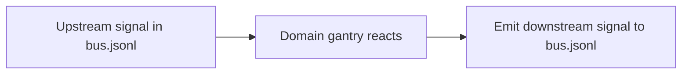

## Schematics

Working directory for short architecture guides and flow notes, organized by domain.

### Conventions

- Prefer **Mermaid** diagrams for flows and state machines.
- Keep diagrams small and link out to deeper docs if needed.
- Treat these as *living* notes; “canonical” specs should eventually move into the appropriate domain docs under `phosphene/domains/<domain>/`.

### Mermaid starter

