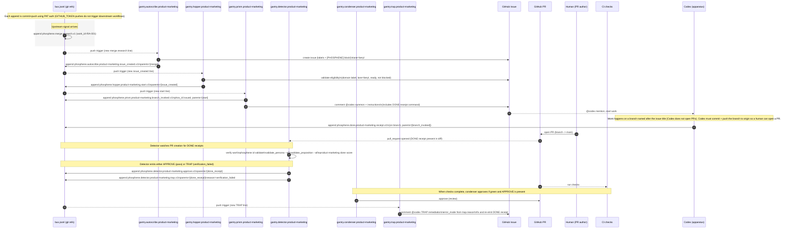

## `<product-marketing>` subflow — bus-only orchestration (lane: `beryl`)

Scope: **only** the `<product-marketing>` orchestration subflow, driven by **bus commits + PR events**:

- Autoscribe → Hopper → Prism → `@codex` summon
- Codex emits a **DONE receipt signal** (bus line) after work completes
- Human opens a PR from the Codex branch to `main` (PR contains the DONE receipt)
- Detector verifies the PR receipt and emits **APPROVE** or **TRAP**
- Condenser waits for checks to pass, then **approves** the PR (no auto-open, no auto-merge)
- Autoscribe may also react to **request signals** addressed to `<product-marketing>` (bus-native bounce)

- **Signals bus**: `phosphene/signals/bus.jsonl`
- **Canonical lane**: `beryl` (product-marketing must not run in other lanes)
- **Routing rule**: upstream gantries **listen on bus push**; detectors/condensers **listen on PR events + checks**; follow-on signals still land on the bus (no workflow-to-workflow routing via `workflow_dispatch`).

---

### Trap (gantry-type error switchboard)

**Trap is a gantry type** whose only job is **error-loop orchestration**:

- It **listens for trap signals** in the bus (domain-tuned).
- It posts a **targeted remediation prompt** as a **comment on the work issue**, explicitly `@codex`-mentioning the worker.
- The comment carries:
  - an **error mode** (what failed and where),
  - the **expected remediation actions** (what to change, what scripts to rerun),
  - and the **required re-emission** of a fresh DONE receipt signal after fixes.

This gives us a single “switchboard” per domain for dynamic error loops without building bespoke logic into every gantry.

---

### Subflow diagram (Mermaid)

---

### Trigger surface (what makes the machinery move)

Everything is activated by **bus pushes** and **PR events**.

- If a gantry needs to create a “footprint” that triggers the next stage, it **must**:
  - append a signal line to `bus.jsonl`, then
  - **commit + push** the bus change using `PHOSPHENE_HUMAN_TOKEN` (PAT-authored), and
  - ensure checkout does **not** persist `GITHUB_TOKEN` credentials (so the PAT is actually used).
- Detectors trigger on **PR opened** events when the PR contains a DONE receipt in the diff.
- Condensers trigger on **checks completed** events and approve when checks are green.
- Autoscribe also consumes `phosphene.request.<requesting_domain>.product-marketing.<work_type>.v1` signals and treats them as upstream triggers (idempotent on `parents`).

---

### Signal contracts (minimal fields; v1)

#### `phosphene.autoscribe.product-marketing.issue_created.v1`

- **Purpose**: record the issue creation as a durable bus footprint.
- **Must include**
  - `work_id`
  - `domain:"product-marketing"`
  - `issue_number`
  - `lane:"beryl"`
  - `parents:[<merge_signal_id>]`

#### `phosphene.hopper.product-marketing.start.v1`

- **Purpose**: declare that the issue is eligible and work should begin.
- **Must include**
  - `work_id`
  - `issue_number`
  - `lane:"beryl"`
  - `parents:[<issue_created_signal_id>]`

#### `phosphene.prism.product-marketing.branch_invoked.v1`

- **Purpose**: prism “beam” event + Codex summon anchor.
- **Must include**
  - `work_id`
  - `issue_number`
  - `lane:"beryl"`
  - `phos_id` (prism-issued)
  - `parents:[<start_signal_id>]`

#### `phosphene.done.product-marketing.receipt.v1`

- **Purpose**: Codex completion receipt. This is the *only* required completion footprint.
- **Must include**
  - `work_id`
  - `issue_number`
  - `lane:"beryl"`
  - `parents:[<branch_invoked_signal_id>]`

#### `phosphene.detector.product-marketing.approve.v1`

- **Purpose**: detector says the work is verified and eligible for condensation.
- **Must include**
  - `work_id`
  - `issue_number`
  - `lane:"beryl"`
  - `parents:[<done_receipt_signal_id>]`

#### `phosphene.detector.product-marketing.trap.v1`

- **Purpose**: failure signal for trap loops (verification failure, CI failure, etc).
- **Must include**
  - `work_id`
  - `issue_number`
  - `lane:"beryl"`
  - `parents:[<done_receipt_signal_id>]` *(or `[<approve_signal_id>]` if CI fails after approval)*
  - `reason` (e.g. `verification_failed`, `checks_failed`)

#### `gantry.trap.<domain>` behavior (applies here as `gantry.trap.product-marketing`)

- **Purpose**: take a `*.trap.v1` signal and convert it into a domain-tuned `@codex` remediation loop on the issue.
- **Inputs**
  - `phosphene.detector.product-marketing.trap.v1`
- **Outputs**
  - a **comment on the issue** that:
    - includes `@codex`,
    - declares `error_mode` derived from `reason`,
    - provides a minimal “fix plan” (what to rerun / where to look),
    - requires a **fresh DONE receipt** to be appended after fixes.
- **Idempotency (recommended)**
  - include a marker in the trap comment like `PHOSPHENE-TRAP:signal_id:<trap_signal_id>` and no-op if it already exists.

#### Condenser approval (PR review)

- **Purpose**: when checks are green, emit `phosphene.condenser.product-marketing.approve.v1` (parented to the detector APPROVE signal) and approve the PR via review (no auto-open, no auto-merge).
- **Gate**: approval only occurs if an APPROVE signal exists in the PR diff and checks are green.

---

### Issue contract (what hopper expects)

The issue must contain a **FORMAL** `[PHOSPHENE]` block (not `INFORMAL`) that includes:

- `lane: beryl`
- `work_type: product-marketing`
- `work_id: <ID>` (e.g. `RA-001` or `VPD-###` depending on your convention)
- `intent: ...`
- `upstream_signal_id: <signal_id>` (optional but strongly preferred)

Labels must include:

- `phosphene`
- `phosphene:domain:product-marketing`
- `phosphene:lane:beryl`
- `phosphene:ready` (and must *not* include blocked/hold labels)

---

### Idempotency rules (how we prevent duplicates)

These checks should hold (and are implemented in the current gantries):

- **Autoscribe idempotency**: if a bus `issue_created` already exists with `parents` containing the triggering merge signal ID, autoscribe no-ops.
- **Hopper idempotency**: if a bus `start` already exists for the `issue_number`, hopper no-ops.
- **Prism idempotency**: if a bus `branch_invoked` already exists whose `parents` contains the `start` signal ID, prism no-ops.
- **Detector idempotency**: if an `approve` or `trap` already exists whose `parents` contains the `done_receipt` signal ID, detector no-ops.
- **Condenser idempotency**: if the PR already has a condenser approval review, condenser no-ops.

