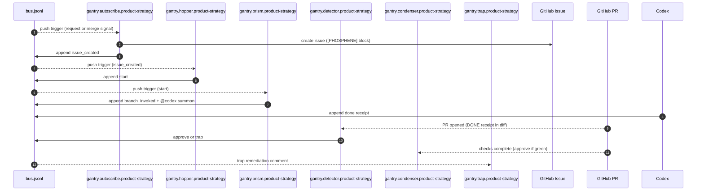

## `<product-strategy>` subflow — bus-only orchestration (lane: `beryl`)

Scope: **only** the `<product-strategy>` orchestration subflow, driven by **bus commits + PR events**:

- Autoscribe → Hopper → Prism → `@codex` summon
- Codex emits a **DONE receipt signal** (bus line) after work completes
- Human opens a PR from the Codex branch to `main` (PR contains the DONE receipt)
- Detector verifies the PR receipt and emits **APPROVE** or **TRAP**
- Condenser waits for checks to pass, then **approves** the PR (no auto-open, no auto-merge)
- Autoscribe may also react to **request signals** addressed to `<product-strategy>` (bus-native bounce)

- **Signals bus**: `phosphene/signals/bus.jsonl`
- **Canonical lane**: `beryl`
- **Routing rule**: upstream gantries listen on bus push; detectors/condensers listen on PR events + checks.

---

### Trap (gantry-type error switchboard)

Trap listens for domain trap signals and posts a remediation comment to the issue with a new DONE receipt required after fixes.

---

### Subflow diagram (Mermaid)

---

### Trigger surface (what makes the machinery move)

Everything is activated by **bus pushes** and **PR events**.

- Autoscribe consumes `phosphene.request.<requesting_domain>.product-strategy.<work_type>.v1` signals.
- Detectors trigger on PR opened events when the PR contains a DONE receipt in the diff.
- Condensers trigger on checks completed events and approve when checks are green.

---

### Signal contracts (minimal fields; v1)

#### `phosphene.autoscribe.product-strategy.issue_created.v1`

- **Must include**: `work_id`, `domain:"product-strategy"`, `issue_number`, `lane:"beryl"`, `parents:[<request_or_merge_signal_id>]`

#### `phosphene.hopper.product-strategy.start.v1`

- **Must include**: `work_id`, `issue_number`, `lane:"beryl"`, `parents:[<issue_created_signal_id>]`

#### `phosphene.prism.product-strategy.branch_invoked.v1`

- **Must include**: `work_id`, `issue_number`, `lane:"beryl"`, `phos_id`, `parents:[<start_signal_id>]`

#### `phosphene.done.product-strategy.receipt.v1`

- **Must include**: `work_id`, `issue_number`, `lane:"beryl"`, `parents:[<branch_invoked_signal_id>]`

#### `phosphene.detector.product-strategy.approve.v1`

- **Must include**: `work_id`, `issue_number`, `lane:"beryl"`, `parents:[<done_receipt_signal_id>]`

#### `phosphene.detector.product-strategy.trap.v1`

- **Must include**: `work_id`, `issue_number`, `lane:"beryl"`, `parents:[<done_receipt_signal_id>]`, `reason`

---

### Issue contract (hopper eligibility)

The issue must contain a **FORMAL** `[PHOSPHENE]` block with:

- `lane: beryl`
- `work_type: product-strategy`
- `work_id: ROADMAP-###`
- `intent: ...`
- `upstream_signal_id: <signal_id>`
