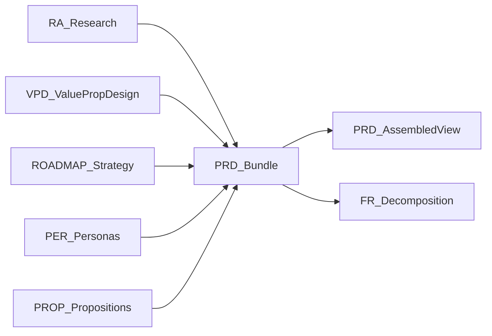

## `<product-management>` PRD bundle topology

Scope: **PRD bundle structure** (`PRD-###-<slug>`) — canonical folder layout, file relationships, assembly order, traceability rules, and decomposition into Feature Requests (FRs).

---

## Authoritative vs generated files

### Authoritative files (source of truth)

These files are the **source of truth** and must be maintained via scripts or explicit edits in the bundle directory:

- `00-coversheet.md` — PRD metadata, status, dependencies header (blank line terminates header)
- `10-executive-summary.md`
- `20-product-context.md`
- `30-personas-jobs-props.md` (references `PER-*`, `PROP-*`, `E-*`)
- `40-goals-scope.md`
- `50-success-metrics.md`
- `60-requirements/functional.md`
- `60-requirements/non-functional.md`
- `70-feature-catalogue/core-features.md`
- `70-feature-catalogue/special-features.md`
- `80-architecture.md`
- `90-platform-technology.md`
- `100-data-integrations.md`
- `110-security-compliance.md`
- `120-ux-content.md`
- `130-delivery-roadmap.md`
- `140-testing-quality.md`
- `150-operations-support.md`
- `160-risks-dependencies.md`
- `170-release-readiness.md`
- `180-appendix/glossary.md`
- `180-appendix/decision-log.md`
- `180-appendix/open-questions.md`
- `180-appendix/traceability-matrix.md`

### Generated files (derived from authoritative sources)

These files are **auto-generated** and should not be hand-edited:

- `PRD-###.md` — assembled, single-file view (read-only)

---

## Canonical folder layout

Root:

- `phosphene/domains/product-management/output/prds/PRD-###-<slug>/`

Bundle layout:

```text
PRD-###-<slug>/
  00-coversheet.md
  10-executive-summary.md
  20-product-context.md
  30-personas-jobs-props.md
  40-goals-scope.md
  50-success-metrics.md
  60-requirements/
    README.md
    functional.md
    non-functional.md
  70-feature-catalogue/
    README.md
    core-features.md
    special-features.md
  80-architecture.md
  90-platform-technology.md
  100-data-integrations.md
  110-security-compliance.md
  120-ux-content.md
  130-delivery-roadmap.md
  140-testing-quality.md
  150-operations-support.md
  160-risks-dependencies.md
  170-release-readiness.md
  180-appendix/
    README.md
    glossary.md
    decision-log.md
    open-questions.md
    traceability-matrix.md
  PRD-###.md              (AUTO-ASSEMBLED)
```

Naming:

- Bundle folder: `PRD-###-<slug>/` (example: `PRD-001-phosphene-prd-template/`)
- PRD ID format: `PRD-###` (stable, globally unique)
- Slug: lowercase, hyphenated, derived from title

---

## Assembly order (deterministic)

When assembling or consuming a PRD bundle, follow this order:

1. `00-coversheet.md`
2. `10-executive-summary.md`
3. `20-product-context.md`
4. `30-personas-jobs-props.md`
5. `40-goals-scope.md`
6. `50-success-metrics.md`
7. `60-requirements/README.md`
8. `60-requirements/functional.md`
9. `60-requirements/non-functional.md`
10. `70-feature-catalogue/README.md`
11. `70-feature-catalogue/core-features.md`
12. `70-feature-catalogue/special-features.md`
13. `80-architecture.md`
14. `90-platform-technology.md`
15. `100-data-integrations.md`
16. `110-security-compliance.md`
17. `120-ux-content.md`
18. `130-delivery-roadmap.md`
19. `140-testing-quality.md`
20. `150-operations-support.md`
21. `160-risks-dependencies.md`
22. `170-release-readiness.md`
23. `180-appendix/README.md`
24. `180-appendix/glossary.md`
25. `180-appendix/decision-log.md`
26. `180-appendix/open-questions.md`
27. `180-appendix/traceability-matrix.md`

The assembled output is written to `PRD-###.md` and must be labeled as auto-generated.

---

## Traceability rules

### Dependencies header (required)

Every PRD bundle **must** include a `Dependencies:` field in the `00-coversheet.md` header block:

```text
ID: PRD-001
Title: <title>
Status: Draft
Updated: YYYY-MM-DD
Dependencies: RA-001, VPD-001, ROADMAP-001
Owner: <name>
EditPolicy: DO_NOT_EDIT_DIRECTLY (use scripts; see .codex/skills/phosphene/cerulean/product-management/modulator/SKILL.md)
```

Rules:

- `Dependencies:` must include all upstream top-level artifacts materially relied on (e.g., `RA-*`, `VPD-*`, `ROADMAP-*`).
- Any PHOSPHENE ID referenced anywhere in the bundle should resolve via `./phosphene/phosphene-core/bin/phosphene id where <ID>`.

### In-body references (informational)

In authoritative section files, reference upstream IDs in-body for navigation:

- Personas: `PER-####`
- Propositions: `PROP-####`
- Research: `RA-###`, `PITCH-####`, `E-####`, `SEG-####`, `CPE-####`
- Strategy: `ROADMAP-###`
- Feature requests: `FR-###`
- PRD parent: `PRD-###` (self-reference only where necessary)

---

## In-doc script hints (`[V-SCRIPT]`)

Each major section should include a discoverability block:

```text
[V-SCRIPT]:
<script_name.sh>
```

This is a pointer, not an executable block. It’s used to quickly locate the relevant control script(s) for that section.

---

## PRD decomposition into Feature Requests (FRs)

PRDs are intended to decompose into `FR-###` dossiers under `<feature-management>`.

Rules:

- Each created `FR-###` must include `Dependencies: PRD-###` in its header.
- FR bodies may cite specific PRD-local identifiers (feature IDs, requirement IDs) for reader navigation.

---

## Done score (quality gate) notes — anti-gaming constraint

The detector uses a deterministic done-score script to gate `<product-management>` PRDs. The score is meant to reward:

- substantive natural-language content (not placeholders)
- requirements filled with acceptance criteria and telemetry
- traceability and linkage density (REQ↔PER/PROP, FEAT↔REQ, traceability matrix coverage)

**Anti-gaming rule:** the scorer intentionally ignores “token dumps” that inflate volume/diversity without adding actionable requirement substance, including:

- giant comma-separated seed lists (e.g. `a,b,c,d,...`)
- long single-line enumerations with many commas (e.g. “lexicon keywords include …, …, …”)

If the bundle contains these, they should be treated as non-substantive and will not improve the done score.

---

## File relationship diagram



