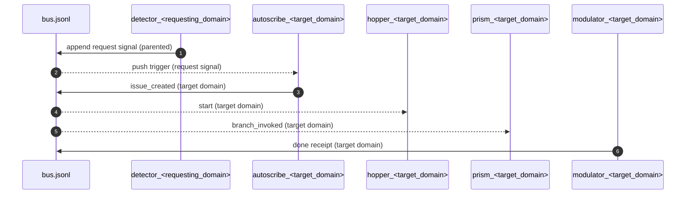

## Request signals subflow — cross-domain bus-native bounce

Scope: **cross-domain** request signals that let one domain ask another to produce upstream constraints.

- **Signals bus**: `phosphene/signals/bus.jsonl`
- **Signal family**: `phosphene.request.<requesting_domain>.<target_domain>.<work_type>.v1`
- **Idempotency**: deterministic `signal_id` via `signal_hash.sh`, parented to the triggering signal.
- **Allowlist**: `requests.allow` in `phosphene/config/<color>.yml` (comma-separated pairs).

---

### Purpose

When a domain detects missing upstream constraints, it emits a **request signal** instead of inventing. Autoscribes in the **target domain** convert the request into a work issue.

---

### Subflow diagram (Mermaid)

---

### Request signal schema (minimal fields; v1)

Required:

- `signal_type`: `phosphene.request.<requesting_domain>.<target_domain>.<work_type>.v1`
- `work_id`: upstream work identifier (often the requester’s work_id)
- `domain`: requesting domain (e.g., `product-management`)
- `target_domain`: requested domain (e.g., `research`)
- `issue_number`: (optional; requesting issue number if present)
- `lane`: lane of the **requesting** domain
- `parents`: array of parent signal IDs (trigger provenance)
- `signal_id`: deterministic (via `signal_hash.sh`)

---

### Allowlist rule

Request signals MUST be gated by the allowlist in config:

- `requests.allow: requester->target,requester->target`
- The request helper refuses to emit if the pair is not listed.

---

### Idempotency rules

- If a request signal with the same `signal_id` already exists, emitters must no-op.
- Autoscribes must no-op if they already emitted `issue_created` with `parents` containing the request signal ID.
