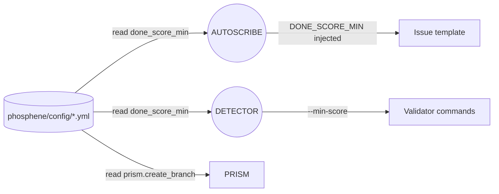

## PHOSPHENE config surface (core)

This schematic defines the **configuration surface** used by gantries to read
owner-adjustable thresholds (e.g., done score minimums). Config is read at
runtime by bash-only helpers and never hard-coded inside workflows.

### Files

- `phosphene/config/global.yml` (posture toggles, e.g., prism.create_branch)
- `phosphene/config/<color>.yml` (flat `key: value` pairs)
- `phosphene/phosphene-core/bin/phosphene_config.sh` (bash-only getter)

### Flow (Mermaid)

