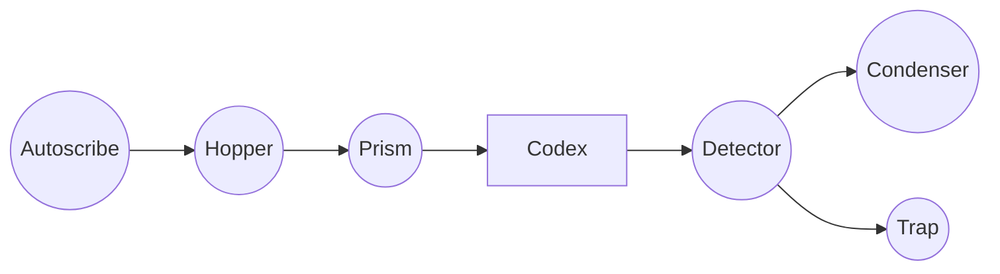

## Option A — PHOSFLOW (compact reactor DSL)

PHOSFLOW is a small, line-oriented DSL intended to be:

- **Readable in PRs**
- **Easy to diff**
- **Parseable without heavy tooling**
- **Annotation-first** (constraints live outside the flow)

### Key idea: “signal is wireless”

When PHOSFLOW says:

```text
AS -[pm.issue_created]-> H
```

It implies:

- `AS` emitted a record to the bus with `signal_type` matching the edge label
- that record caused `H` to react (via a bus push trigger)

We do **not** spell out “append to bus” / “push triggers” unless we want to.

---

## Syntax

### Reactor header

```text
reactor "<id>" {
  domain: product-marketing
  lane: beryl
  version: 0.1
}
```

### Components

```text
node AS : gantry.autoscribe(product-marketing)
node H  : gantry.hopper(product-marketing)
node P  : gantry.prism(product-marketing)
node D  : gantry.detector(product-marketing)
node K  : gantry.condenser(product-marketing)
node T  : gantry.trap(product-marketing)
node CX : apparatus.codex

node ISSUE : external.github.issue
node PR    : external.github.pr
node CI    : external.ci
```

### Signals (edges)

```text
edge e1: UP -[phosphene.merge.research.v1]-> AS
edge e2: AS -[phosphene.autoscribe.product-marketing.issue_created.v1]-> H
edge e3: H  -[phosphene.hopper.product-marketing.start.v1]-> P
edge e4: P  -[phosphene.prism.product-marketing.branch_invoked.v1]-> CX
edge e5: CX -[phosphene.done.product-marketing.receipt.v1]-> D
edge e6: D  -[phosphene.detector.product-marketing.approve.v1]-> K
edge e7: D  -[phosphene.detector.product-marketing.trap.v1]-> T
edge e8: K  -[phosphene.merge_complete.product-marketing.v1]-> UP
edge e9: K  -[phosphene.detector.product-marketing.trap.v1]-> T
```

### Non-signal interactions (optional)

Use `call` for “this isn’t a bus signal, but it matters”:

```text
call c1: AS -> ISSUE : create_issue(labels, phos_block)
call c2: P  -> ISSUE : comment("@codex …")
call c3: K  -> PR    : open_pr(branch_beam -> main)
call c4: CI -> PR    : checks(status)
```

### Annotations (kept out of flow)

Annotations reference node IDs, edge IDs, or call IDs:

```text
annot a1: on H require lane=beryl, ready=true, blocked=false
annot a2: on K require CI.checks=green

annot a3: idempotent AS by parent_edge=e1
annot a4: idempotent H by key=issue_number
annot a5: idempotent P by parent_edge=e3
annot a6: idempotent D by parent_edge=e5
annot a7: idempotent K by parent_edge=e6

annot a8: trap_mode e7 reason=verification_failed
annot a9: trap_mode e9 reason=checks_failed
```

---

## Minimal grammar (EBNF-ish)

```text
reactor      := header nodes flows annotations
header       := "reactor" string "{" { kv } "}"
kv           := ident ":" value

nodes        := { node }
node         := "node" ident ":" ident [ "(" ident ")" ]

flows        := { edge | call }
edge         := "edge" ident ":" ident "-[" ident "]->" ident
call         := "call" ident ":" ident "->" ident ":" text

annotations  := { annot }
annot        := "annot" ident ":" text
```

Notes:

- `ident` is `[A-Za-z_][A-Za-z0-9_.-]*`
- `text` is the remainder of the line (or a quoted string)

---

## Worked example: `<product-marketing>` bus subflow (beryl)

```text
reactor "pm.beryl.subflow.v1" {
  domain: product-marketing
  lane: beryl
  version: 0.1
}

node UP    : external.upstream
node AS    : gantry.autoscribe(product-marketing)
node H     : gantry.hopper(product-marketing)
node P     : gantry.prism(product-marketing)
node CX    : apparatus.codex
node D     : gantry.detector(product-marketing)
node K     : gantry.condenser(product-marketing)
node T     : gantry.trap(product-marketing)
node ISSUE : external.github.issue
node PR    : external.github.pr
node CI    : external.ci

edge e1: UP -[phosphene.merge.research.v1]-> AS
call c1: AS -> ISSUE : create_issue(domain=product-marketing, lane=beryl, formal_phos_block=true)
edge e2: AS -[phosphene.autoscribe.product-marketing.issue_created.v1]-> H

call c2: H -> ISSUE : validate(domain_label, lane=beryl, ready=true, blocked=false, formal_phos_block=true)
edge e3: H -[phosphene.hopper.product-marketing.start.v1]-> P

edge e4: P -[phosphene.prism.product-marketing.branch_invoked.v1]-> CX
call c3: P -> ISSUE : comment("@codex … error_mode=none")

edge e5: CX -[phosphene.done.product-marketing.receipt.v1]-> D
call c4: D -> D : verify(id_validate, validate_persona_all, validate_proposition_all, done_score)

edge e6: D -[phosphene.detector.product-marketing.approve.v1]-> K
edge e7: D -[phosphene.detector.product-marketing.trap.v1]-> T

call c5: K -> PR : open_pr(branch_beam -> main)
call c6: CI -> PR : checks(status)
edge e8: K -[phosphene.merge_complete.product-marketing.v1]-> UP
edge e9: K -[phosphene.detector.product-marketing.trap.v1]-> T

call c7: T -> ISSUE : comment("@codex remediation … error_mode=<trap.reason>")

annot a1: on H require lane=beryl
annot a2: on D emit e6 OR e7 (mutually exclusive)
annot a3: on K require CI.checks=green else emit e9
annot a4: on T require @codex mention, include PHOSPHENE-TRAP:signal_id marker
```

---

## Making PHOSFLOW Mermaid-compatible (PHOSFLOW-M)

Yes: we can achieve essentially all of Option A **inside a Mermaid flowchart**, without turning the diagram into the “notation”.

The trick is:

- Mermaid is the **render layer**
- PHOSFLOW is embedded as **structured comments** (not rendered), so annotations stay “out of the image flow”

### Convention

- Lines beginning `%%phosflow:` are parseable directives.
- The Mermaid nodes/edges can be kept minimal (or even auto-generated later).

### Example: PHOSFLOW embedded in Mermaid



What you get:

- Mermaid stays valid and renders a simple diagram.
- Your custom visualizer can parse `%%phosflow:*` for the **true model** (stable edge IDs, calls, annotations).
- The diagram stays uncluttered because the semantics live in comments.

