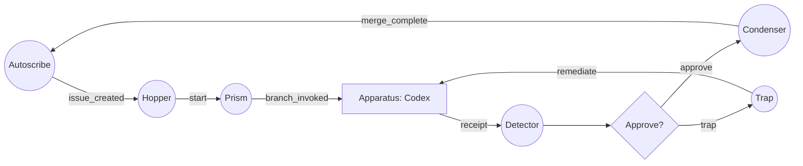

## Option D — Mermaid loop diagram (system view)

This is intentionally **not** part of the reactor *notation* options. It’s a **system diagram view** that we can generate from any of the notations later.

Constraints you asked for:

- **Gantries are circles**
- **Apparatus is a square**
- **Decision points are diamonds** placed after the deciding gantry
- Diagram is designed to **loop**
  - `Condenser -> Autoscribe`
  - `Trap -> Apparatus`

### Product-marketing loop (beryl) — Mermaid flowchart

Notes:

- This diagram **assumes signals are wireless** (implicit bus). The arrows represent “a signal causes the next component to react”.
- If you want, we can add optional externals (`Issue`, `PR`, `CI`) as separate shapes, but I kept it to your core loop + decision semantics.

