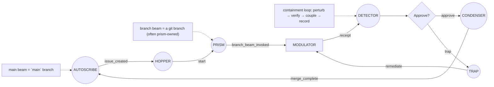
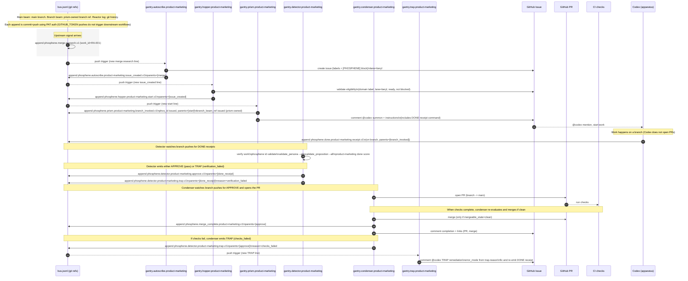

## PHOSPHENE Reactor (overview and instrument taxonomy)

**Scope:** This is a human-readable map of the PHOSPHENE Reactor: the in-universe physics (how a git repo behaves inside the reactor), the control surfaces humans see, and the instrument taxonomy that manipulates beams and signals. It does not define new runtime behavior. It exists to make operational truth legible: what each instrument does, what it touches, and what it emits downstream.

---

#### Reactor physics (why a “reactor”, not a “factory”)

A PHOSPHENE Reactor is a weird-science conceit for explaining why git-based operations have different physics to most work systems. Inside the reactor, “phosphene” (or **phos**) is the plasma-like state of an uncompiled repository: information-dense, highly deformable, reversible, and cheap to duplicate.

Phos behaves less like material on a conveyor and more like a confined beam in a collider or a toroid of plasma in a tokamak. You can split it into parallel beams, explore many shapes, and then coherently couple successful changes back into the stable beam. The reactor metaphor is chosen to make a single point feel obvious: when the “substance” is code, duplication is effectively free, branching is natural, and recombination is a controlled act of resonance rather than physical assembly.

**Core properties you should assume inside the reactor:**

* **Near-free duplication:** branch beams can be created in large numbers with minimal cost.
* **Reversible morphing:** phos can be reshaped into almost any configuration and reshaped again; prior shapes remain accessible.
* **Resonant coupling:** validated changes can be reintroduced to the main beam, shifting the reactor’s stable frequency.
* **Stable equilibrium:** a quiet repo is an unperturbed, stable containment state, not “inert”.
* **Perturbations are events:** any commit perturbs a beam (main or branch) and becomes part of the reactor’s observable history.

#### Reactor anatomy (beams, logs, and perturbations)

Inside a phosphene reactor, the **main beam** corresponds to the repository’s `main` branch. **Branch beams** are git branches spun off the main beam for isolated work and experimentation.

The reactor’s historical record is the **reactor log**, which corresponds to git history: commits are the durable trace of perturbations over time. The current state of the reactor is the current state of each beam. From a schematic perspective, you treat equilibrium as “stable containment” and treat commits as perturbations that instruments detect, route, validate, and optionally couple back into the main beam.

---

### Gantries (orchestration instruments)

**Everything in PHOSPHENE is an instrument**, but instruments fall into two operational classes. **Gantries** manipulate beams and signals: they read state, route work, gate coupling, and record footprints. They do not directly change phos. **Apparatus** are the instruments that actually shape phos: they edit the reactor, generate artifacts, and emit receipts that gantries can verify and couple.

Gantries are the traffic controllers. They read signals, interpret state, and move work forward by emitting new signals, but they are not the place where domain work is performed. Operationally, a gantry’s “write” is usually a footprint rather than a payload: it appends a signal line to the bus and leaves a trace in the work’s control surface, rather than directly authoring phos-shaping artifacts. In PHOSFLOW diagrams they are circles (`((...))`), because they are “reactors” rather than “workers”: they listen, decide, and coordinate.

#### DETECTOR

The `DETECTOR` is the ruling corridor: you hand it a ref (a branch beam or the main beam) and it deterministically evaluates predicates against what it finds there. A detector is how PHOSPHENE turns “someone says it’s done” into “the system agrees it’s done,” because it can validate IDs, run domain validators, and compute “done scores” in a consistent way. Detectors treat receipts as invitations to verify, and treat verification as beam physics, not social trust. When it finishes, it emits a ruling signal (approve or trap) that downstream gantries can treat as a reliable gate rather than a conversation.

#### PRISM

The `PRISM` is the dispatcher: it splits and aims branch beams, fanning work out into an execution context without doing the work itself. In practice, that means it issues the minimal execution anchor inside the reactor (for example, a prism-owned branch beam reference and a prism-issued ID), and it issues the summons that starts the apparatus running. If the detector is the judge, the prism is the stage manager: it sets the scene, points the spotlight, and then gets out of the way.

#### CONDENSER

The `CONDENSER` is the coupler: it turns a green ruling into a coupling action, bringing a validated branch beam back into resonance with the main beam. In implementation terms, that typically means “open a PR, wait for checks, merge when clean, and leave a durable footprint that coupling completed.” Condensers exist so the reactor can be strict about verification without being precious about process: if the work is verified, the condenser does the mechanical merge work and records it in the reactor log; if the work isn’t mergeable, it emits a trap reason that routes back into remediation rather than silently failing.

#### AUTOSCRIBE

The `AUTOSCRIBE` is the cleric that creates the public record. It turns explicit triggers into flimsies (GitHub Issues) with a canonical, machine-readable `[PHOSPHENE] ... [/PHOSPHENE]` block that other instruments can safely interpret. Operationally, autoscribe is special because it is the only instrument allowed to create or mutate flimsies (title/body/labels/assignees/state); that strictness keeps the “case file” coherent even when many other instruments are active and beams are splitting and recombining.

#### HOPPER

The `HOPPER` is the gate at the flimsie boundary. It watches flimsie updates, checks whether a flimsie is eligible to start (domain label, lane, ready/not-blocked, and whether it can parse the canonical PHOSPHENE block), and then emits the “start” signal that wakes a prism. The hopper’s personality is intentionally strict and boring: if it can’t parse, it asks autoscribe to fix; if it’s not eligible, it says why; if it is eligible, it starts the machine and gets out of the way.

#### TRAP

The `TRAP` is the error-loop switchboard. It listens for trap signals (for example, “verification failed” or “checks failed”) and converts them into a targeted remediation prompt attached to the work’s public record (typically as a flimsie comment that includes the worker summon). The trap’s value is that it keeps failure handling dynamic without smearing ad-hoc error logic across every other instrument: detectors and condensers simply emit reasons; trap turns those reasons into a next action that routes the loop back toward stable containment, and a clear instruction to re-emit a fresh completion receipt when fixed.

#### TEST.EMITTER / TEST.LISTENER

`TEST.EMITTER` and `TEST.LISTENER` are gantries that exist to make the signal pathways observable and regression-testable. They are not part of the “business loop,” but they behave like real instruments in miniature: one emits a probe signal, the other listens for it and reacts, so you can prove the bus-triggered orchestration is still alive.

---

### Apparatus (work execution instruments)

Apparatus are the workers. Where a gantry manipulates beams and records footprints, an apparatus changes phos: it edits the reactor, generates artifacts, and produces the domain outputs that verification can later judge. In PHOSFLOW diagrams apparatus are squares (`[...]`), because they are “doers” rather than “deciders.”

#### MODULATOR

The `MODULATOR` is the canonical apparatus shape: the work-configured executor that performs domain tasks under the constraints of the lane and the dossier. It is deliberately described as an instrument rather than a brand-name runtime: the runtime supplier is not hard-wired, and PHOSFLOW conventions explicitly avoid baking a specific supplier into diagrams. The expectation you should carry is simple: modulators shape phos from within; collectors import and refine phos from outside. In both cases, the apparatus emits a completion receipt signal; the receipt is the durable perturbation trace detectors use for verification.

#### COLLECTOR

The `COLLECTOR` is an apparatus that acquires raw phos from outside the reactor and refines it into a usable form. Operationally, it is how the reactor gains new information: ingesting external sources (research, docs, datasets, transcripts, reference repos) and transforming them into repo-native artifacts that can be verified, versioned, and coupled back into the main beam. A collector emits the same kind of durable completion receipt as other apparatus, so downstream detectors can treat ingestion as verifiable work rather than a narrative claim.

---

### Flimsies (work orders and human control surface)

Flimsies are the reactor’s work-order system: the public case files that humans can read, steer, and audit while the instruments do the beam work. The name is borrowed from carbon-copy flimsies used in manufacturing and reactor operations: lightweight, duplicable paperwork that still functions as the canonical record.

PHOSPHENE treats flimsies as a controlled interface. Tool permissions are deliberately strict so the case file stays coherent under swarm conditions. As a baseline rule: **AUTOSCRIBE is the only instrument allowed to create or mutate flimsies** (title, body, labels, assignees, state, canonical `[PHOSPHENE] ... [/PHOSPHENE]` blocks). Other instruments may leave footprints (comments or links) only where explicitly permitted by policy. This keeps human observability stable even while beams fork, loop, and recombine at high frequency.

---

### Substrate mapping (how instruments become a delegated cloud system)

The Reactor metaphor stays honest because it names the substrate directly. **Gantries are GitHub Actions workflows** (the deterministic orchestration plane), and **apparatus are bash skill bundles and scripts** (the phos-shaping plane) executed by a delegated runtime that may be generative, remote, and autonomous. What makes PHOSPHENE unusual is that these are not two separate systems glued together with ad-hoc calls; they are one continuous control surface whose shared memory is the repo itself.

In implementation terms, gantries live under `.github/workflows/` and behave like simple sensors and actuators: they observe perturbations (pushes and controlled work-order changes), run narrow verification and routing logic, and then emit the next perturbation. They are designed to be boring on purpose, because you want the orchestration layer to be predictable, replayable, and safe to run in a fully delegated environment.

Apparatus, by contrast, are intentionally “strong” inside their containment volume. A modulator or collector can exercise judgment, generate content, and reshape a branch beam into a new configuration of artifacts; it can be run by a cloud agent (currently optimized for a Codex Cloud worker via `@codex` summons) or by other delegated runtimes later. The key constraint is not “don’t be powerful,” it is “be powerful in a beam, then prove what you did with receipts and validators before coupling.”

The reason the repo is treated as primary state is practical: delegated systems need a place to put memory that survives process boundaries and provider boundaries. In PHOSPHENE, **the reactor log is git history**, and the bus is a file in that history. That choice makes the entire harness portable: if it’s in the repo, it is schedulable, auditable, testable, and reproducible without introducing a second database that must be trusted.

#### No direct wiring: routing happens through signals, not workflow-to-workflow calls

PHOSPHENE intentionally avoids “instrument-to-instrument” links as an architectural coupling mechanism. In particular, it does not rely on daisy-chaining actions via `workflow_dispatch` as the main routing fabric. Instead, instruments communicate by leaving traces in the substrate: **signals are appended to the bus**, and downstream instruments react to those repo perturbations. This is why the system can remain coherent across fully remote, fully delegated workers: the substrate carries the message, not the process.

#### Signals are pheromones (stigmergy, but made legible and checkable)

The signals system is explicitly stigmergic: coordination happens through **environmental traces** rather than direct messaging. `phosphene/signals/bus.jsonl` is the pheromone trail: a durable, append-only-by-convention log of “what just happened,” “what should happen next,” and “what must be verified.” Gantries and apparatus do not need to know each other; they only need to recognize a small vocabulary of trace types and respond with their own small output traces.

Those traces are engineered to be hard to counterfeit casually and easy to audit. Each bus record carries a `tamper_hash` computed over the line bytes (with the `tamper_hash` value normalized), which makes hand edits detectable unless the official update step is run (`phosphene/phosphene-core/bin/signal_bus.sh` and `signal_tamper_hash.sh`). This is not secret-key authentication, but it is a practical integrity guardrail, and it composes with git’s own content-addressed history to make the reactor’s trace layer meaningfully tamper-evident in practice.

Separately, PHOSPHENE uses stable SHA-256 IDs to uniquely identify signals as nodes in a monotonic DAG: a signal ID is derived from its parents plus a run marker and output key (`phosphene/phosphene-core/bin/signal_hash.sh`). That means “what you emitted” is uniquely named in a way downstream instruments can reference without needing an external coordinator.

#### The harness-of-harnesses principle (why colours and domains exist)

The apparent complexity is the price of tight scope. Each instrument is deliberately small in what it can interpret and what it is allowed to output, in the same way a colony can exhibit complex swarm behavior even when any single insect is following a tiny set of rules based on local pheromone gradients. The agent’s intelligence is not removed; it is contained. A worker can be unbounded inside a branch beam while still being unable to rewrite the reactor’s governance, because the only sanctioned path back to the stable beam is through receipts, detectors, and coupling rules.

Colours and domains are how you scale that containment without breaking the reactor. If you want new capability, you do the upfront work to define a new lane or a new domain contract (validators, scripts, signals, and detector predicates). Once that harness exists, you can deploy it as part of the whole system with high confidence: it will scale in delegated cloud environments because it is forced to speak in the same trace language, obey the same coupling gates, and leave the same kind of verifiable footprints.

---

### Spooling and safety (auxiliary workflows)

Spooling and safety workflows are not the mainline orchestration loop, but they occupy the same ecosystem: they exist for controlled instantiation, release, deployment, and guardrail actions where you want deterministic, auditable automation.

Spools are how the reactor produces durable products. To “spool phos” is to extract a beam state from the reactor and solidify it into a compiled, packaged release. In-world, that is the phase change from plasma-like phos to a stable artifact that can be shipped, installed, sold, and audited. Economically, spool control is the profit engine: whoever can run reactors safely, verify coupling, and spool reliably can generate many products quickly by exploiting the unique physics of information work. The reactor makes exploration cheap; the spool makes outcomes valuable.

“Safety” is where you’d expect emergency actions like ejecting a branch beam to live. They are part of the taxonomy because they represent distinct operational intent, even when implemented as separate workflow families.

---

### The loop mindset (reactor loops, not process lines)

PHOSPHENE schematics are built around loops because the reactor is a living toroid of phos under containment. The steady state is equilibrium. Signals and commits are perturbations. Instruments form closed loops that converge on stable coupling: summon work, shape a beam, emit a receipt, verify, couple, and record. When verification fails, failure becomes a first-class signal that routes into remediation and re-verification until the beam returns to an acceptable containment state.

---

### Worked example: a real loop, end-to-end, with expectations

The easiest way to “get” PHOSPHENE is to see the loop twice: first as a compact PHOSFLOW sketch that names only the instruments and signals, and then as a concrete bus-only instantiation that shows the real-world externals (flimsie, PR, CI) and the error loop in motion.

#### At-a-glance PHOSFLOW loop

This compact loop is the mental model you should keep even as domains vary: gantries coordinate by emitting signals, the apparatus does the work, detector decides, condenser couples, and trap routes remediation back into the apparatus. In this style of diagram, the apparatus is always `MODULATOR` (the runtime supplier is not the point).

#### Concrete bus-only sequence loop

The diagram below is copied from the existing schematic `schematics/product-marketing/product-marketing_bus_subflow.md`. It is intentionally “bus-only”: every stage is triggered by pushes to the signals bus, and every stage leaves a durable footprint by appending a new line and pushing again. This specific instance names the current runtime supplier in its participant label (`Codex (apparatus)`), but functionally you can read that participant as “the modulator” in the abstract model above.

Read this loop as a set of expectations you can lean on. When an upstream signal lands, autoscribe will externalize it into a flimsie with a parseable PHOSPHENE block; hopper will either start the job or refuse it with a clear reason; prism will create the minimal execution anchor and summon the worker; the apparatus will do the work and leave a single, durable “DONE receipt” perturbation trace; detector will treat that receipt as an invitation to verify rather than a claim to trust; condenser will couple verified work back into the main beam (and, in implementation terms, merge it to `main`) and record the result; and trap will convert any failure state into a remediation loop that points back at the worker with enough context to try again. If everything goes well, the loop closes on `merge_complete`; if anything fails, the loop stays alive because failure becomes a first-class signal rather than a silent dead end.

