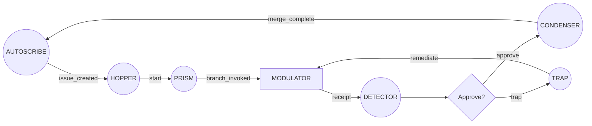
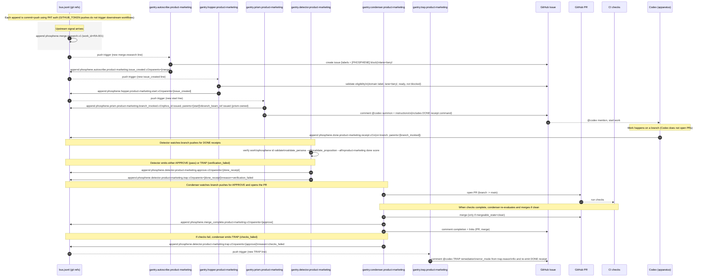

## PHOSPHENE instrument types (narrative reference)

Scope: this is a human-readable “what are the instruments?” map. It does not define new behavior. It tries to keep the PHOSPHENE voice, but it gets to operational truth fast: what each instrument does, what it touches, and what you should expect it to emit downstream.

---

### Gantries (orchestration instruments)

Gantries are the traffic controllers. They read signals, interpret state, and move work forward by emitting new signals, but they are not the place where domain work is performed. Operationally, a gantry’s “write” is usually a footprint rather than a payload: it appends a signal line to the bus (and may comment on an Issue), rather than directly authoring domain artifacts. In PHOSFLOW diagrams they are circles (`((...))`), because they are “reactors” rather than “workers”: they listen, decide, and coordinate.

#### DETECTOR

The `DETECTOR` is the ruling corridor: you hand it a ref (a branch or `main`) and it deterministically evaluates predicates against what it finds there. A detector is how PHOSPHENE turns “someone says it’s done” into “the system agrees it’s done,” because it can validate IDs, run domain validators, and compute “done scores” in a consistent way. When it finishes, it emits a ruling signal (approve or trap) that downstream gantries can treat as a reliable gate rather than a conversation.

#### PRISM

The `PRISM` is the dispatcher: it fans work out into an execution context without doing the work itself. In practice, that usually means it creates the minimal anchor needed for a worker to operate (for example, a branch beam reference and a prism-issued ID), and it issues the summons that starts the apparatus running. If the detector is the judge, the prism is the stage manager: it sets the scene, points the spotlight, and then gets out of the way.

#### CONDENSER

The `CONDENSER` is the coupler: it turns a green ruling into a coupling action, typically “open a PR, wait for checks, merge when clean, and leave a durable footprint that the merge completed.” Condensers exist so the system can be strict about verification without being precious about process: if the work is verified, the condenser does the mechanical merge work and records it; if the work isn’t mergeable, it emits a trap reason that routes back into remediation rather than silently failing.

#### AUTOSCRIBE

The `AUTOSCRIBE` is the cleric that creates the public record. It turns explicit triggers into flimsies (GitHub Issues) with a canonical, machine-readable `[PHOSPHENE] ... [/PHOSPHENE]` block that other instruments can safely interpret. Operationally, autoscribe is special because it is the only instrument allowed to create or mutate Issues (title/body/state/labels/assignees); that strictness keeps the “case file” coherent even when many other instruments are active.

#### HOPPER

The `HOPPER` is the gate at the Issue boundary. It watches Issue updates, checks whether an Issue is eligible to start (domain label, lane, ready/not-blocked, and whether it can parse the canonical PHOSPHENE block), and then emits the “start” signal that wakes a prism. The hopper’s personality is intentionally strict and boring: if it can’t parse, it asks autoscribe to fix; if it’s not eligible, it says why; if it is eligible, it starts the machine and gets out of the way.

#### TRAP

The `TRAP` is the error-loop switchboard. It listens for trap signals (for example, “verification failed” or “checks failed”) and converts them into a targeted remediation prompt attached to the work’s public record (typically as an Issue comment that includes the worker summon). The trap’s value is that it keeps failure handling dynamic without smearing ad-hoc error logic across every other instrument: detectors and condensers simply emit reasons; trap turns those reasons into a next action and a clear instruction to re-emit a fresh completion receipt when fixed.

#### TEST.EMITTER / TEST.LISTENER

`TEST.EMITTER` and `TEST.LISTENER` are gantries that exist to make the signal pathways observable and regression-testable. They are not part of the “business loop,” but they behave like real instruments in miniature: one emits a probe signal, the other listens for it and reacts, so you can prove the bus-triggered orchestration is still alive.

---

### Apparatus (work execution instruments)

Apparatus are the workers. Where a gantry coordinates, an apparatus changes the world: it creates artifacts, edits the repo, and produces the domain outputs that verification can later judge. In PHOSFLOW diagrams apparatus are squares (`[...]`), because they are “doers” rather than “deciders.”

#### MODULATOR

The `MODULATOR` is the canonical apparatus shape: the work-configured executor that performs domain tasks under the constraints of the lane and the dossier. It is deliberately described as an instrument rather than a brand-name runtime: the runtime supplier is not hard-wired, and PHOSFLOW conventions explicitly avoid baking “Codex” into diagrams. The expectation you should carry is simple: modulators produce the outputs, then emit a completion receipt signal that gives detectors something concrete to verify.

---

### Spooling and safety (auxiliary workflows)

Spooling and safety workflows are not the mainline orchestration loop, but they occupy the same ecosystem: they exist for controlled instantiation, release, deployment, and guardrail actions where you want deterministic, auditable automation. “Spool” is where you’d expect lifecycle operations like bundling and releasing to live; “Safety” is where you’d expect emergency actions like ejecting a branch beam to live. They are part of the taxonomy because they represent distinct operational intent, even when implemented as separate workflow families.

---

### Worked example: a real loop, end-to-end, with expectations

The easiest way to “get” PHOSPHENE is to see the loop twice: first as a compact PHOSFLOW sketch that names only the instruments and signals, and then as a concrete bus-only instantiation that shows the real-world externals (Issue, PR, CI) and the error loop in motion.

#### At-a-glance PHOSFLOW loop

This compact loop is the mental model you should keep even as domains vary: gantries coordinate by emitting signals, the apparatus does the work, detector decides, condenser couples, and trap routes remediation back into the apparatus. In this style of diagram, the apparatus is always `MODULATOR` (the runtime supplier is not the point).

#### Concrete bus-only sequence loop

The diagram below is copied from the existing schematic `schematics/product-marketing/product-marketing_bus_subflow.md`. It is intentionally “bus-only”: every stage is triggered by pushes to the signals bus, and every stage leaves a durable footprint by appending a new line and pushing again. This specific instance names the current runtime supplier in its participant label (`Codex (apparatus)`), but functionally you can read that participant as “the modulator” in the abstract model above.

Read this loop as a set of expectations you can lean on. When an upstream signal lands, autoscribe will externalize it into an Issue with a parseable PHOSPHENE block; hopper will either start the job or refuse it with a clear reason; prism will create the minimal execution anchor and summon the worker; the apparatus will do the work and leave a single, durable “DONE receipt” trace; detector will treat that receipt as an invitation to verify rather than a claim to trust; condenser will couple verified work back into `main` and record the merge; and trap will convert any failure state into a remediation loop that points back at the worker with enough context to try again. If everything goes well, the loop closes on `merge_complete`; if anything fails, the loop stays alive because failure becomes a first-class signal rather than a silent dead end.

