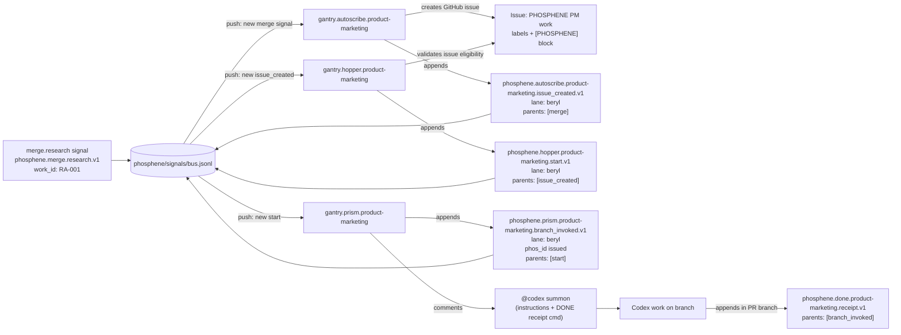

## `<product-marketing>` subflow — bus-only orchestration (lane: `beryl`)

Scope: **only** the `<product-marketing>` orchestration subflow (Autoscribe → Hopper → Prism → Codex DONE receipt), driven entirely by **bus commits**.

- **Signals bus**: `phosphene/signals/bus.jsonl`
- **Canonical lane**: `beryl` (product-marketing must not run in other lanes)
- **Routing rule**: gantries **listen on bus push** and **emit follow-on signals to the bus** (no workflow-to-workflow routing via `workflow_dispatch`).

---

### Subflow diagram (Mermaid)

---

### Trigger surface (what makes the machinery move)

Everything is activated by **pushes to `phosphene/signals/bus.jsonl`**.

- If a gantry needs to create a “footprint” that triggers the next stage, it **must**:
  - append a signal line to `bus.jsonl`, then
  - **commit + push** the bus change using `PHOSPHENE_HUMAN_TOKEN` (PAT-authored), and
  - ensure checkout does **not** persist `GITHUB_TOKEN` credentials (so the PAT is actually used).

---

### Signal contracts (minimal fields; v1)

#### `phosphene.autoscribe.product-marketing.issue_created.v1`

- **Purpose**: record the issue creation as a durable bus footprint.
- **Must include**
  - `work_id`
  - `domain:"product-marketing"`
  - `issue_number`
  - `lane:"beryl"`
  - `parents:[<merge_signal_id>]`

#### `phosphene.hopper.product-marketing.start.v1`

- **Purpose**: declare that the issue is eligible and work should begin.
- **Must include**
  - `work_id`
  - `issue_number`
  - `lane:"beryl"`
  - `parents:[<issue_created_signal_id>]`

#### `phosphene.prism.product-marketing.branch_invoked.v1`

- **Purpose**: prism “beam” event + Codex summon anchor.
- **Must include**
  - `work_id`
  - `issue_number`
  - `lane:"beryl"`
  - `phos_id` (prism-issued)
  - `parents:[<start_signal_id>]`

---

### Issue contract (what hopper expects)

The issue must contain a **FORMAL** `[PHOSPHENE]` block (not `INFORMAL`) that includes:

- `lane: beryl`
- `work_type: product-marketing`
- `work_id: <ID>` (e.g. `RA-001` or `VPD-###` depending on your convention)
- `intent: ...`
- `upstream_signal_id: <signal_id>` (optional but strongly preferred)

Labels must include:

- `phosphene`
- `phosphene:domain:product-marketing`
- `phosphene:lane:beryl`
- `phosphene:ready` (and must *not* include blocked/hold labels)

---

### Idempotency rules (how we prevent duplicates)

These checks should hold (and are implemented in the current gantries):

- **Autoscribe idempotency**: if a bus `issue_created` already exists with `parents` containing the triggering merge signal ID, autoscribe no-ops.
- **Hopper idempotency**: if a bus `start` already exists for the `issue_number`, hopper no-ops.
- **Prism idempotency**: if a bus `branch_invoked` already exists whose `parents` contains the `start` signal ID, prism no-ops.

